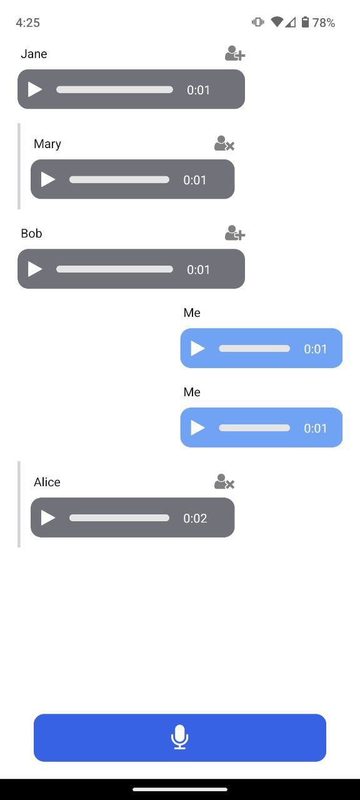

# Voice Social Media
Short prototype for school project from Artem and Shouvik

## Installation and Execution

1. Install Node.js and npm: Download and install them from [https://nodejs.org/](https://nodejs.org/).

2. Install Expo CLI globally using npm: Run `npm install -g expo-cli` in your terminal.

3. Clone this repository: Use `git clone <repository-url>`.

4. Navigate into the project directory: `cd <project-directory>`.

5. Install project dependencies: Run `npm install`.

6. Start the Expo development server: Run `expo start`.

7. Open the app on your phone: Scan the QR code in your terminal or in Expo Dev Tools (in your browser). Refer to the [Expo Go documentation](https://docs.expo.dev/get-started/expo-go/) for more information.
